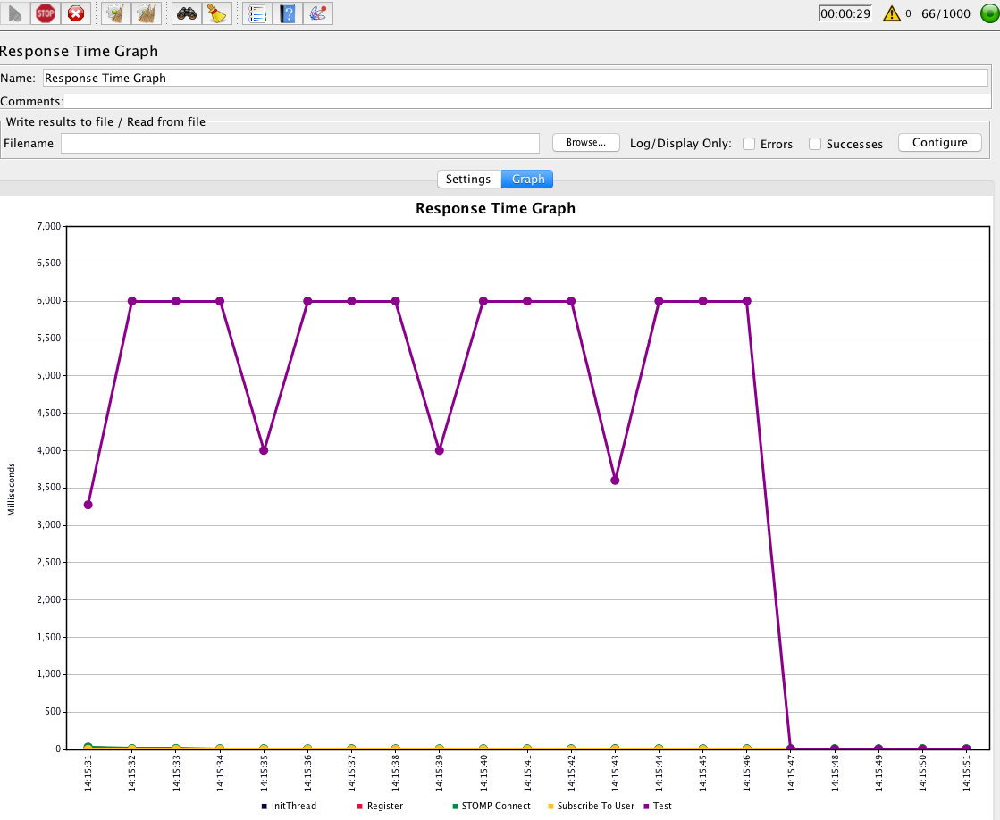
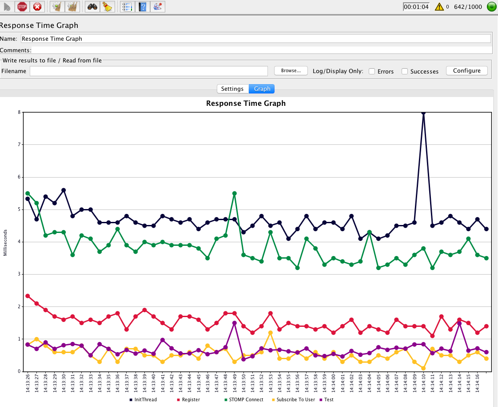

# Intro

This repository is showing an issue that I have with spring websocket. When you run the jmeter test you notice that only very few clients can be handled by and the response times of the "test" endpoint runs into timeouts. But if you exchange the rabbitmq as the message broker with the simple broker implementation you can handle thousands of users.

# How to run the application

1. Start rabbitmq with the STOMP plugin. I provide a docker-compose file in the `docker` folder that does that.
2. Start the application (either via gradle, IDE or `java`, whatever you prefer)
3. Start `jmeter/bin/jmeter` and load the `jmeter-test.jmx` file.
4. Adjust the test parameters as you whish and fire.

# Test Configuration

The test will perform a simple registration, establish the websocket/STOMP connection, subscribe to the user queue and then fires a test message every 4 seconds as long as the specified session length is. One jmeter thread (`thread_count`) is equivalent to one user.

You can adjust the parameters in the test plan.

# Issue

You'll notice that you can run the test only with a handful of clients and most of them will run into timeouts for the test endpoint. But when you exchange the message queue with the simple broker you won't have this issue. You can checkout the `simple-broker` branch to verify that behavior.

*RabbitMQ as message broker*

*Simple Broker as message broker.*

Note: For the simple broker the above image does not represent the limit.

# ALTERNATIVE: JUnit Test

You can also reproduce the issue with the provided unit tests in `PerformanceIssueApplicationTests`.

